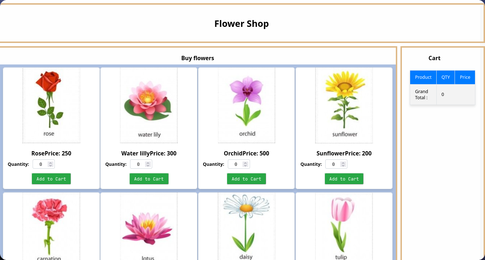
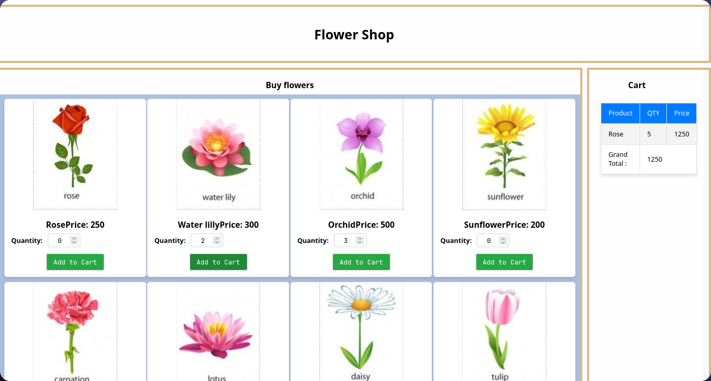
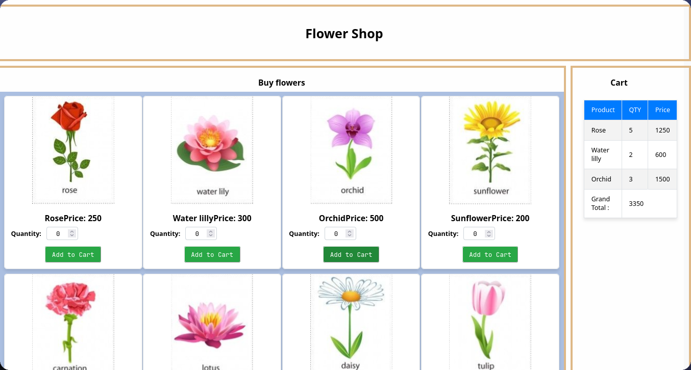

# 2020/ICT/19
# IT3133(P) ICAE 01

# Flower Shop React Application

A simple e-commerce web application for a flower shop built with React. Users can browse flowers, add them to cart, and manage their shopping cart.

## Features

- Browse flower catalog
- Add flowers to shopping cart
- Adjust quantities in cart
- View total price
- Responsive design

## Project Structure

flower-shop/<br/>
│<br/>
├── src/<br/>
│   ├── assets/<br/>
│   │   ├── CSS/<br/>
│   │   │   └── layout.css<br/>
│   │   └── image/<br/>
│   │       └── [flower images]<br/>
│   │<br/>
│   ├── components/<br/>
│   │   ├── Product.js<br/>
│   │   ├── FlowerDB.js<br/>
│   │   ├── Products.js<br/>
│   │   └── Cart.js<br/>
│   │<br/>
│   └── App.js<br/>
│<br/>
└── README.md<br/>

## Installation

1. Clone the repository
```bash
git clone [repository-url]
```

2. Install dependencies
```bash
npm install
```

3. Start the development server
```bash
npm start
```

The application will open in your default browser at `http://localhost:3000`

## Usage

- Browse the flower catalog on the main page
- Adjust quantity using the number input
- Click "Add to Cart" to add flowers to your shopping cart
- View your cart items and total on the right side

## Dependencies

- React
- React DOM

## Component Structure

### Products.js
Main component that handles:
- Display of all flowers
- Cart state management
- Adding items to cart

### Product.js
Individual product component that shows:
- Flower image
- Name and price
- Quantity selector
- Add to cart button

### Cart.js
Shopping cart component that displays:
- Cart items
- Quantities
- Individual prices
- Total price

## Data Structure

FlowerDB.js contains the flower data in the following format:
```javascript
{
    id: number,
    name: string,
    qty: number,
    img: string,
    price: number,
}
```

## Contributing

1. Fork the repository
2. Create your feature branch (`git checkout -b feature/AmazingFeature`)
3. Commit your changes (`git commit -m 'Add some AmazingFeature'`)
4. Push to the branch (`git push origin feature/AmazingFeature`)
5. Open a Pull Request

## Outputs

**Figure 1:**

**Figure 2:**

**Figure 3:**

**Figure 4:**
